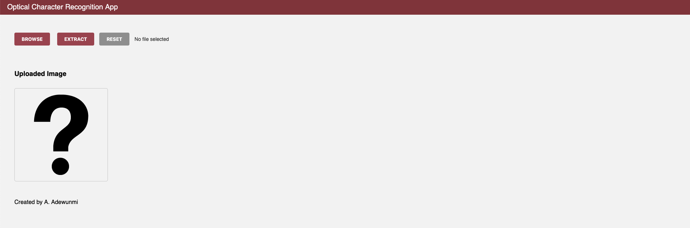
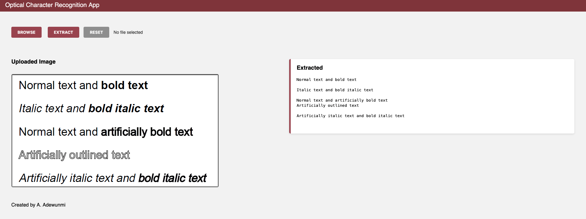

# 🔍✨ **Optical Character Recognition (OCR) App - Unleash the Text Within\!** ✨🔍

Tired of retyping text from images? Our sleek and intuitive web-based OCR app is here to liberate you\!

Effortlessly upload your images and watch as they magically transform into editable text with a single click.

Experience the power of seamless image-to-text conversion, wrapped in a modern and user-friendly interface. 🖼️➡️📜

-----

## 🚀 **Experience the Magic: Key Features**

  * **Universal Image Support 📂:** Upload a wide range of image formats including JPG, PNG, and more. No matter the source, if it contains text, we can handle it\!
  * **Versatile Text Extraction 🔠:** Our intelligent OCR engine expertly deciphers various text styles, from standard printed fonts to more artistic, stylized lettering and even artificially bolded or outlined text. See the examples in action\!
  * **Visual Confirmation 🖼️:** Get instant feedback\! The app displays your uploaded image, ensuring you've selected the correct file before extraction.
  * **The Powerhouse Duo 🧠:** Built upon the robust foundation of `pytesseract`, a Python wrapper for Google's renowned Tesseract OCR engine, guaranteeing accuracy and reliability.
  * **Effortless Interaction ⚡:** Enjoy a fluid and responsive user experience with instant results delivered right to your screen.
  * **Clean Slate with Reset 🔄:** Need to process another image? The "RESET" button swiftly clears the interface, allowing you to start anew without any hassle.

-----

## 🕹️ **Live Demo - See It In Action\!**

> Ready to witness the magic firsthand? Follow the setup instructions to run the app locally, or imagine it deployed on platforms like Replit or Render, ready to serve your OCR needs\!





 ---

## 🛠️ **Under the Hood: Tech Stack**

We've combined cutting-edge web technologies with a powerful OCR engine to bring you this seamless experience:

|   Frontend         |   Backend        |   OCR Engine                  |
|   :--------------- |   :------------- |   :-------------------------- |
|   HTML5, CSS3, Flexbox |   Flask (Python) |   Tesseract OCR (`pytesseract`) |

The clean and responsive frontend, crafted with HTML5, CSS3, and Flexbox, ensures a delightful user experience across devices. Behind the scenes, Flask, a lightweight and flexible Python web framework, manages the server-side logic. The core of the text extraction is powered by Tesseract OCR, accessed through the `pytesseract` Python library.

-----

## ⚙️ **How It Works: A Simple Workflow**

1.  **Image Upload:** You select and upload an image file containing text.
2.  **Visual Preview:** The uploaded image is displayed, allowing you to confirm your selection.
3.  **Initiate Extraction:** Clicking the "EXTRACT" button sends the image to our OCR engine.
4.  **Text Revelation:** The extracted text is processed and beautifully presented alongside the original image.
5.  **Start Afresh:** The "RESET" button clears both the image and the extracted text, preparing the app for your next task.

-----

## 🛠️ **Get Started: Installation Guide**

Ready to run the OCR app on your local machine? Follow these simple steps:

```bash
#   1. Clone the repository to your local machine
git clone https://github.com/AAdewunmi/Optical_Character_Recognition_Project.git
cd Optical_Character_Recognition_App

#   2. Install the necessary Python dependencies
pip install -r requirements.txt

#   3. Ensure Tesseract OCR is installed on your operating system.
#      Follow the official installation guide for your specific OS:
#      👉 https://github.com/tesseract-ocr/tesseract/wiki/Installation

#   Example for Debian/Ubuntu:
sudo apt install tesseract-ocr
#   Example for macOS (using Homebrew):
brew install tesseract

#   4. Run the Flask development server
python app.py
```

Once the server starts, open your web browser and navigate to `http://127.0.0.1:5000/` to see the app in action\!

-----

## 📂 **Project Structure: A Peek Inside**

```
ocr-app/
├── app.py                    # The heart of the Flask application
├── ocr_utils.py              # Contains the core OCR logic using pytesseract
├── templates/
│   └── index.html            # The HTML structure for the user interface
├── static/
│   └── style.css             # Stylesheet for the app's appearance
├── uploads/
│   └── Optical_blank.png     # A default image placeholder
├── requirements.txt          # List of Python packages to install
├── Optical_Character_Recognition_Project.ipynb # Jupyter Notebook detailing the OCR process
└── README.md                 # The file you're currently reading! 😎
```

-----

## ⚠️ **Before You Begin: Prerequisites**

Make sure you have the following installed on your system:

  * **Python 3.7+:** The programming language that powers the backend.
  * **Tesseract-OCR:** The open-source OCR engine that does the heavy lifting. Ensure it's installed and its executable is in your system's PATH.
    👉   [Tesseract Installation Guide](https://github.com/tesseract-ocr/tesseract/wiki/Installation)

-----

## 🧠 **Did You Know? A Little OCR History\!**

> Fun Fact: Tesseract's journey began at Hewlett Packard Laboratories in the mid-1980s\! It has since evolved into a highly regarded and remarkably accurate open-source OCR engine, continuously improved by a dedicated community. Its longevity and accuracy make it a cornerstone of modern OCR technology\!

-----

## 🙌 **Gratitude and Acknowledgements**

We extend our sincere thanks to the developers and contributors of the following amazing open-source projects:

  * 🔡 **pytesseract:** For providing a clean and effective Python interface to Tesseract. ([https://github.com/madmaze/pytesseract](https://github.com/madmaze/pytesseract))
  * 🧠 **Tesseract OCR:** For the powerful and versatile OCR engine that makes this app possible. ([https://github.com/tesseract-ocr/tesseract](https://github.com/tesseract-ocr/tesseract))
  * 🎨 The user interface design is inspired by the simplicity and elegance of modern dashboard applications.

-----

## 🤖 AI Assistance

This project was developed with help from [ChatGPT](https://openai.com/chatgpt) by OpenAI — for guidance on OCR implementation, Flask integration, and UI enhancements,

Special thanks to [Gemini](https://gemini.google.com/) by Google AI for their invaluable assistance in significantly improving the clarity, readability, and completeness of this README.md.

-----

## 📬 **Let's Connect\!**

Made with ❤️ by Adrian Adewunmi

  * [GitHub](https://github.com/AAdewunmi)

Feel free to reach out with any questions, suggestions, or feedback\!

-----

## 📜 **License**

This project is open-source and licensed under the [MIT License](LICENSE). Feel free to use, modify, and share it as per the terms of the license.


